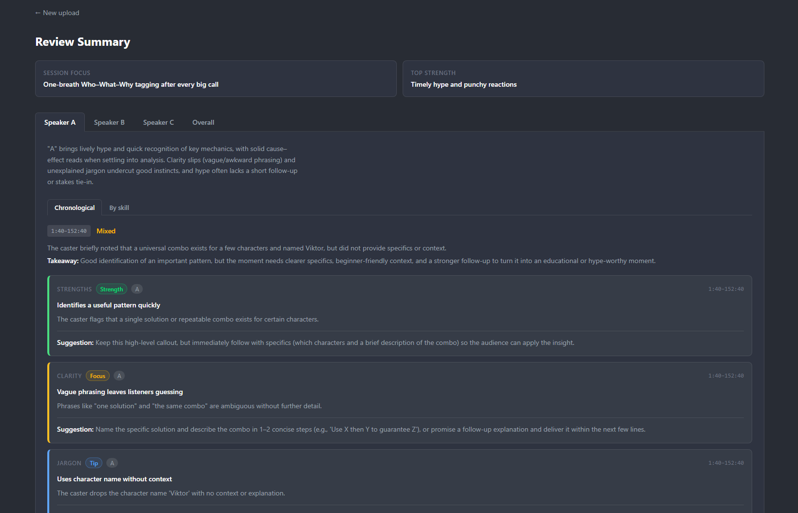
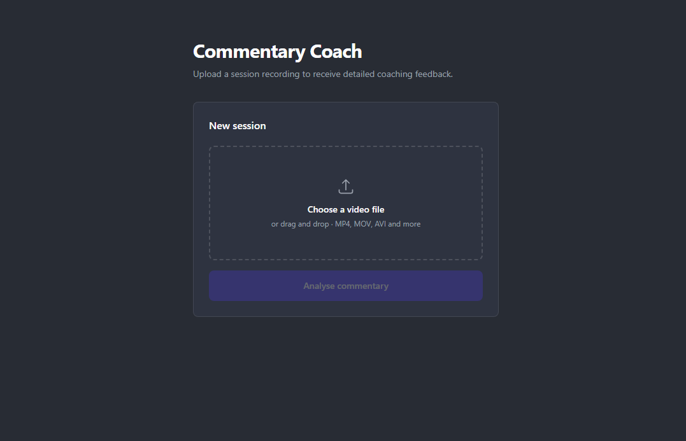
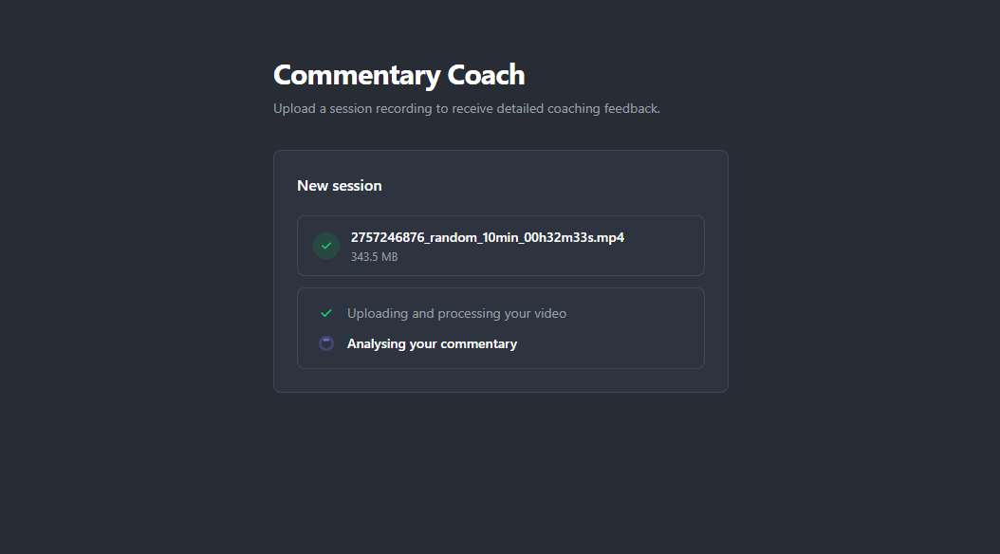
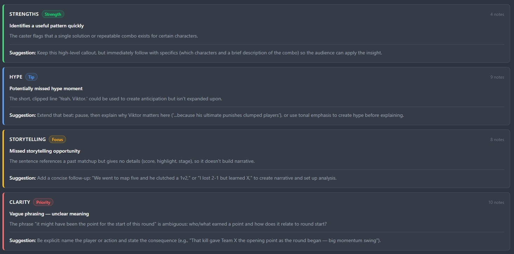
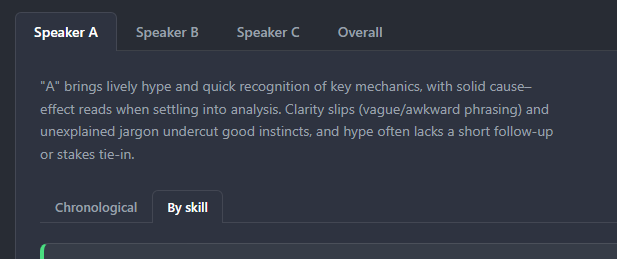

This is a simple preview of the Esports Commentary Feedback Assistant I've been working on. Its purpose is to reduce the overhead of mentors teaching or analysing another's work as a commentator by the use of a simple interface that presents a high level analysis in a clean and easily digestible layout.

*An example of results page*

The idea of this project came about looking for ways to engage with making an educative tool with the use of AI. The mission to help teachers engage with their students and help them improve with lower mental and physical overheads drives this project. As someone who is learning to be a better commentator myself, this tool serves me as a user as well.

Built using Node.js using the Express framework to serve as the API, this server reaches out to an AI agent. This prompt is written with the domain knowledge of esports commentating in mind, and so, can be improved on when needed. I believe this is important to note, as this drives the idea that this is a tool to enhance, not replace, a mentor or teacher.

It is also built with the idea that the Agent being used should be able to be changed. This means different APIs and models provided by those APIs should be interchangeable.

*The index page where the user starts the analysis*

The flow of using the tool aims to be simple and focused. No distraction to the process, simple to reason about. After a user uploads their video, it's processed through APIs in chunks to analyse the commentary, with a synthesis step to reason about the chunks.

*How the UI presents the processing to the user*

The feedback is presented in easily digestible tabs and cards, chosen as such to have the mind focus on each piece of feedback with visual barriers to stop it wandering, pioritising focus and readability. Each card is colour coded to bring attention to them and provide a clue immediately to the user to understand what that card is about, as well as using words such as "Strength", "Tip" and "Priority" in order to focus on learning, rather than judgement or scoring.

*An example of the cards used for feedback*

The tabs themselves allow a way to focus on a particular mentee commentator for both them and the mentor, to not distract or compare to the other individuals involved, as well as how they wish to analyse the commentary. An overarching statement lives with each speaker tab, to get a synthesis, quickly providing a general idea of their commmentary.

*An example of the tabs used for feedback*

There's also a "chronological" tab, and a "by skill" tab, each aim to bring different lenses to how the commentary is reviewed. "Chonological" provides the "play by play" of the commentary, giving an idea of how the commentator flowed over time. The "By Skill" tab condenses the strengths and possible areas to work on into groups, counting the amount of times each appeared through the commentary seen in the "chronological" tab.

My hope for this project is to become more than just an educational tool for esports commentary. Rather, I'd like for many coaches to use a more general version of this web app for their needs. For example, public speaking and storytelling are examples of skills that could yield benefit from this. Maybe the analysis could in the future have the ability to use the visual component of the video, and we can consider gameplay review.  